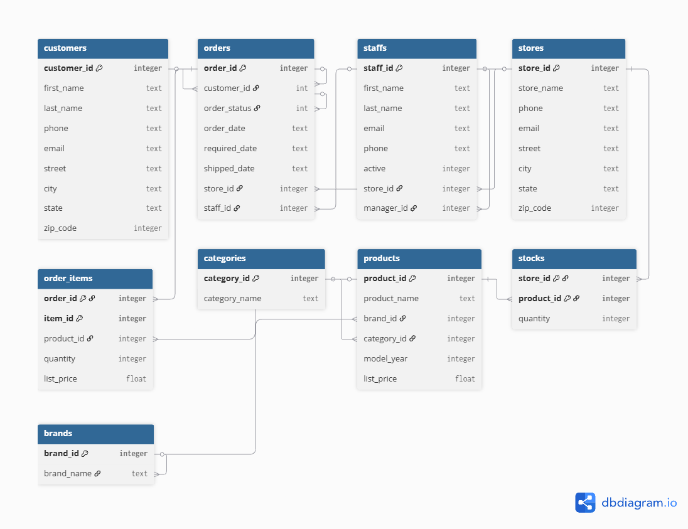

# Bike-Store-Relational-Database-SQL 
Project Overview:
- This project performs data analysis of a multi-store bicycle retail chain using SQL.

Database Schema:
The database consists of 9 tables organized into two main schemas:

- Sales: customers, orders, order_items, staffs, and stores.

- Production: categories, brands, products, and stocks.

The diagram above represents the relational model of the Bike Store database,
including entities such as Customer, Orders, Products, and Staff, as well as
their relationships and primary and foreign keys.

Questions solved:

Total Revenue per Store:
SELECT s.store_name, TO_CHAR(SUM(oi.quantity * oi.list_price),'L999,999,999.99') AS total FROM stores s
JOIN orders o ON s.store_id = o.store_id
JOIN order_items oi ON o.order_id = oi.order_id
GROUP BY s.store_name
ORDER BY total DESC;

Top 15 Most Expensive Products:
SELECT  p.product_name, TO_CHAR(MAX(p.list_price), 'L999,999,999.99') AS Most_Expensive FROM products p
GROUP BY p.product_name
ORDER BY MAX(p.list_price) DESC
LIMIT 15;

Order Count per Staff Member:
SELECT s.first_name , COUNT(o.staff_id) AS order_count, st.store_name FROM staffs s
JOIN orders o ON s.staff_id = o.staff_id
JOIN stores st ON s.store_id = st.store_id
GROUP BY s.first_name , st.store_name
ORDER BY order_count DESC;

Average Product Price by Category:
SELECT c.category_name, to_char(AVG(p.list_price),'L999,999,999.99' ) FROM categories c
JOIN products p ON c.category_id = p.category_id
GROUP BY c.category_name
ORDER BY to_char(AVG(p.list_price),'L999,999,999.99' ) DESC;

Revenue by Category:
SELECT c.category_name,to_char (SUM(oi.quantity * oi.list_price), 'L999,999,999.99') AS Top_revenue_category, COUNT(oi.product_id)  AS times_sold FROM categories c 
JOIN products p ON c.category_id = p.category_id
JOIN order_items oi ON p.product_id = oi.product_id
GROUP BY c.category_id, c.category_name
ORDER BY Top_revenue_category DESC;

Out-of-Stock Products:
SELECT p.product_name AS NO_STOCK FROM products p
join stocks s ON p.product_id = s.product_id
WHERE s.quantity = 0
GROUP BY p.product_name
ORDER BY p.product_name;

Frequent Customers (More than 2 orders):
SELECT CONCAT(c.first_name,' ',c.last_name) AS full_name, COUNT(o.customer_id) AS orders FROM customers c
JOIN orders o ON c.customer_id = o.customer_id
GROUP BY c.customer_id, CONCAT(c.first_name,' ',c.last_name)
HAVING COUNT(o.customer_id) > 2
ORDER BY orders DESC;

Average Order Value (AOV) per Customer:
WITH Total_price_per_order AS (
  SELECT oi.order_id, o.customer_id, SUM(oi.quantity * oi.list_price) AS total FROM order_items oi
  JOIN orders o ON oi.order_id = o.order_id
  GROUP BY oi.order_id, o.customer_id
)
SELECT CONCAT(c.first_name,' ',c.last_name) AS full_name, to_char(AVG(t.total),'L999,999,999.99') FROM customers c
JOIN Total_price_per_order t ON c.customer_id = t.customer_id
GROUP BY c.customer_id,c.first_name,c.last_name
ORDER BY to_char(AVG(t.total),'L999,999,999.99') DESC;

Products Never Sold: 
SELECT p.product_name AS zero_sales_product FROM products p 
LEFT JOIN order_items oi ON p.product_id = oi.product_id
WHERE oi.product_id IS NULL
GROUP BY p.product_id
ORDER BY p.product_name;
